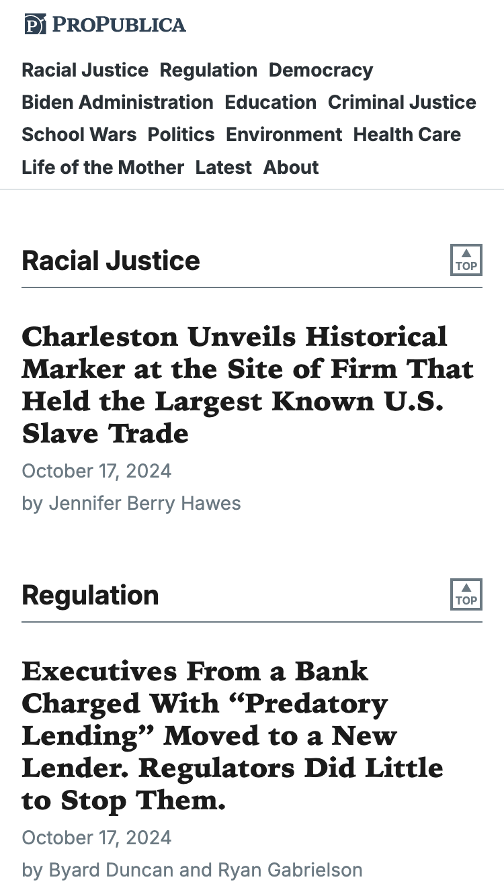
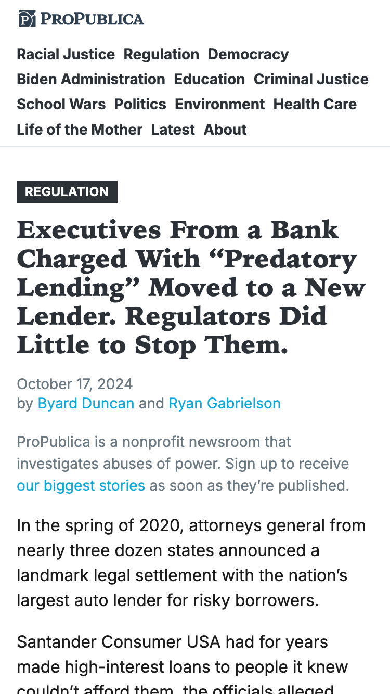
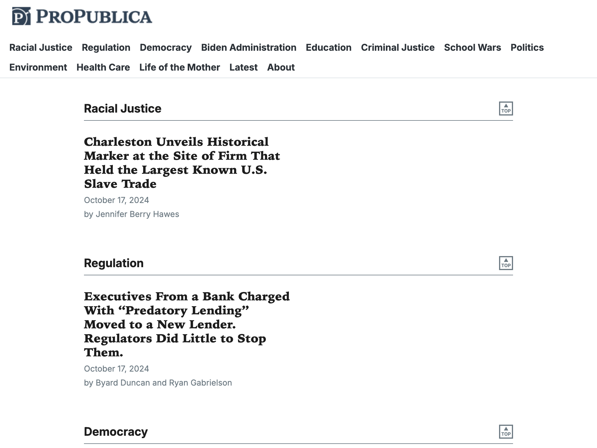
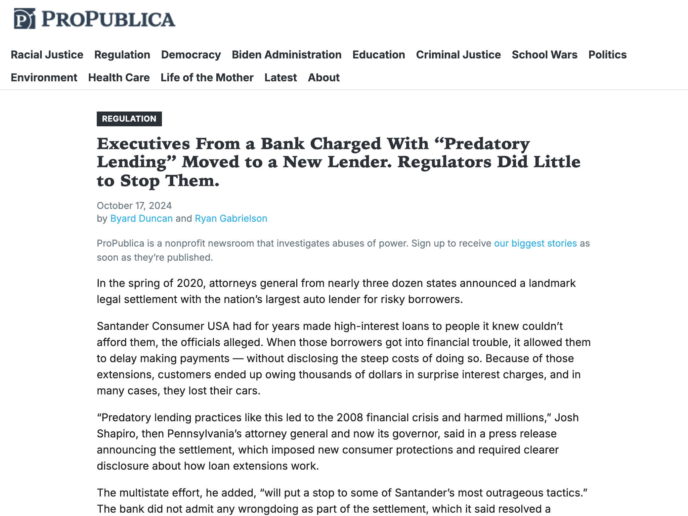

# RSS Express

A low-bandwidth feed reader for ProPublica, built with PHP, and powered by RSS.

## Getting Started

- Open the project folder: `cd rss-express`
- Start PHP server: `php -S localhost:8000 -t public/`
- View the site here: [http://localhost:8000/](http://localhost:8000/`)

If you need to build the theme assets:

- Install node packages: `npm install`
- Build the theme assets: `npm run build`
- Set up Composer: `composer install`

## Screenshots

### Index, Mobile:

### Article, Mobile:

### Index, Desktop:

### Article, Desktop:

